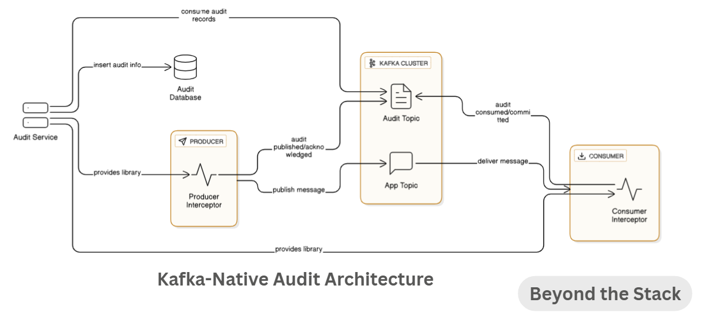

# Kafka Message Audit

A toolset for auditing Kafka messages, featuring producers, consumers, and interceptors for detailed message tracking and validation.

## Features

- `producer` & `producerInterceptor`: Send messages with auditing metadata.
- `consumer` & `consumerInterceptor`: Receive and audit messages.
- `audit-common`: Shared utilities and models.
- `integrationTests`: Validate end-to-end message flow.

## Getting Started

This a multi module Maven project. Each module can be built and run independently.
To build the entire project, navigate to the root directory and run:

```bash
mvn clean install
```
### Modules
- `audit-common`: Contains shared models and utilities for auditing.
- `producer`: Kafka producer with auditing capabilities.
- `producerInterceptor`: Interceptor for the producer to add auditing metadata.
- `consumer`: Kafka consumer with auditing capabilities.
- `consumerInterceptor`: Interceptor for the consumer to validate auditing metadata.
- `integrationTests`: Contains integration tests to validate the entire message flow.
- `audit` : A Spring Boot application that consumes audit record and maintain message audit.


### Prerequisites

- Java 17 (or your specific version)
- Maven 3.8.0+
- Apache Kafka cluster (tested on Embedded Kafka provided by spring-kafka-test)

The repository is based on my edition in my LinkedIn newsletter 'Beyond the Stack'.
You can read the article here: https://www.linkedin.com/pulse/stop-logging-everything-kafka-already-has-truth-pradeep-gupta-mu2gc/

You can read all the article in newsletter here: https://www.linkedin.com/newsletters/beyond-the-stack-6991127734901612544/

## Architecture


